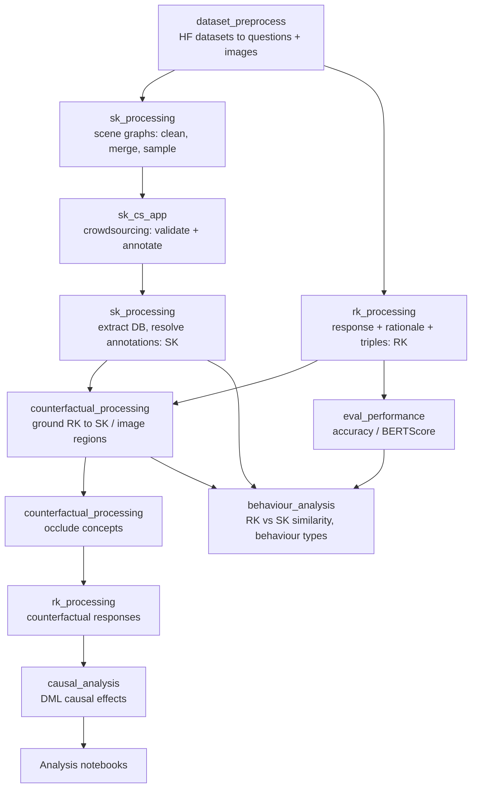

# DiaVLo: Diagnosing Behaviours of Vision-Language Models

[**DiaVLo: Diagnosing the Behaviours of Vision-Language Models**](https://arxiv.org/abs/2609.22008)

*Lorenzo Corti*, Jie Yang

To appear in [Findings of the Association for Computational Linguistics: EMNLP 2026](https://2026.emnlp.org/).

DiaVLo is a diagnostic framework for VLMs. It builds two specifications and compares them:

- **Should-Knows (SK)** are what a model *should* rely on for a given image and question. They are scene-graph triples `(concept, relation, concept)` that start as machine-generated scene graphs and are refined by crowd workers.
- **Really-Knows (RK)** are what the model *relies* on. They are triples extracted from the model's own self-explanation and grounded to image regions.

Comparing RK against SK (embedding similarity) yields **behaviour labels**. On top of that, DiaVLo occludes the grounded concepts in the image, collects the model's counterfactual responses, and estimates the **causal effect** of each concept on the answer.

## Pipeline overview



## Supported models and datasets

| Models (config key) | Datasets (config key) | Task type |
|---|---|---|
| InternVL2-8B (`internvl2`, `OpenGVLab/InternVL2-8B`) | LLaVA-Bench in-the-wild (`llava-bench`) | open-ended |
| LLaVA-1.6 (`llava-1.6`, `liuhaotian/llava-v1.6-vicuna-7b`) | MMBench-EN dev, captioning questions: `image_scene`, `image_topic` (`mmbench`) | open-ended (captioning) |
| ShareGPT4V (`sharegpt4v`, `Lin-Chen/ShareGPT4V-7B`) | SEED-Bench-2: `scene_understanding`, `visual_reasoning` (`seed`) | multiple choice |
| Qwen2.5-VL (`qwen2_5_vl`, `Qwen/Qwen2.5-VL-7B-Instruct`) | VQA v2 validation: `how_many_people_are`, `what_is_the_person` (`vqav2`) | short answer |

> Note: `vqav2_holdout` (`is_the_person`, `is_this_person`) is an additional and unused VQA v2 split. The handlers exclude it from the dataset list unless you ask for it.

## Repository structure

| Directory | Purpose |
|---|---|
| `dataset_preprocess/` | Notebooks that download the datasets from Hugging Face (`lmms-lab/MMBench_EN`, `lmms-lab/SEED-Bench-2`, `lmms-lab/VQAv2`, `liuhaotian/llava-bench-in-the-wild`), keep the relevant question types, save the images, and write the question files (`q_*.jsonl`). |
| `sk_processing/` | Scripts that build and clean Should-Knows (see [SK pipeline](#2-should-knows-sk)). |
| `sk_cs_app/` | The crowdsourcing web app (Flask + MySQL, run with Docker) used to validate and refine the scene graphs into SKs. It has its own [README](sk_cs_app/README.md). |
| `rk_processing/` | Collects model responses and Really-Knows. Contains one folder per model (`InternVL2/`, `LLaVa-1.6/`, `Qwen2.5-VL/`, `ShareGPT4V/`) plus shared helpers. The model implementations are taken unmodified from the original repositories. The `*_cli.py`, `*_self.py`, `*_occlusion.py` and attribution scripts are new. |
| `counterfactual_processing/` | Matches RKs to SKs and image regions, creates occluded images, and holds the OVD and NMS threshold ablations. |
| `causal_analysis/` | Estimates and analyses the causal effects of concepts on model outputs. |
| `behaviour_analysis/` | Compares RK against SK and derives behaviour types, with plots and notebooks. |
| `eval_performance/` | Evaluates the VLMs (accuracy / BERTScore-F1). |
| `config/` | YAML configuration: file layouts under `data/` and the prompts. |
| `config_handlers/` | Python classes that read the configs and build the paths into `data/`. |
| `utils/` | Shared helpers: I/O, graph conversion and statistics, image handling, text cleaning, visualisation, question formatting. |
| `data/` | All inputs and outputs. See [Data layout](#data-layout). |
| `env_*.yml` | Conda environments (see [Setup](#setup)). |
| `make_hf_cache.sh` | Creates the Hugging Face cache folder on the remote machine. |

## Setup

Two conda environments are provided. Each has a local (for me, macOS / MPS) and a remote (Linux / CUDA 12.6) version.

| Environment | Local | Remote | Used for |
|---|---|---|---|
| `mllm_diag` | `env_mllm_diag.yml` | `env_mllm_diag_vm.yml` | Everything except the causal estimation: datasets, models, RK/SK processing, evaluation, behaviour analysis. |
| `causal` | `env_causal.yml` | `env_causal_vm.yml` | `causal_analysis/`. Uses DoWhy 0.13 and EconML 0.16 separately so that they do not interfere with other dependencies. |

```bash
# Local machine (MPS)
conda env create -f env_mllm_diag.yml
conda env create -f env_causal.yml

# Remote machine (CUDA)
conda env create -f env_mllm_diag_vm.yml
conda env create -f env_causal_vm.yml
```

Notes:

- Use `causal` for causal estimation.
- Model inference in `rk_processing/` calls `.cuda()` directly, so generation scripts need a CUDA machine.
- The open-ended causal scripts use spaCy `en_core_web_trf` and download it on first use if it is missing (`python -m spacy download en_core_web_trf`).
- `make_hf_cache.sh` creates `/data/storage/huggingface` on the remote machine. Skip it if the default Hugging Face cache is fine.
- On the remote machine, large artefacts (occluded images) are written to `/data/storage` if that directory exists. Otherwise they go inside the project (`utils.data_io.add_path_to_surf_storage`).

### Working directory convention

Most scripts add `..` to `sys.path` and read and write files relative to it (`Path("..", "data", ...)`). **Run each script from inside its own directory**, for example:

```bash
cd eval_performance && python run_eval.py
```

Model scripts in `rk_processing/<Model>/` are the exception: they resolve the repo root as `../..`, so run them from inside `rk_processing/<Model>/`.

## Configuration

`config/*.yaml` describes the file layout under `data/`, keyed by model, dataset and class. `config_handlers/` wraps each file in a handler with `set_curr_*()` and `get_*_path()` methods:

| Config | Handler | Points to |
|---|---|---|
| `dataset_paths.yaml` | `DatasetHandler` | `data/datasets/` (questions, sampled questions, images) |
| `sk_paths.yaml` | `SKHandler` | `data/should_know/` (scene graphs, crowd steps, final SKs, pickled graphs) |
| `rk_paths.yaml` | `RKHandler` | `data/really_know/` (raw, parsed, final RKs, pickles) |
| `ce_paths.yaml` | `CausalHandler` | `data/causal_effects/` (counterfactual responses, estimates, occluded images) |
| `eval_paths.yaml` | `EvalHandler` | `data/eval_performance/` |
| `prompts/self_explanations/se_v{1..5}.yaml` | `PromptHandler` | Prompts per model and dataset. **Version 4 is the one used** (`PROMPT_VERSION = 4` in the scripts). Other versions are unused iterations. |
| `prompts/counterfactual/counter_resp.yaml` | `PromptHandler` | _Unused_, earlier prompt-based counterfactual prompts. |

## Running the pipeline

The steps below follow the pipeline in order. Replace `<model>` and `<dataset>` with the config keys from the table above.

### 1. Datasets
1. Run the notebooks in `dataset_preprocess/`: `llava-bench`, `mmbench`, `seed` and `vqav2` (`vqav2_holdout` is unused). Each one downloads the dataset, saves the images under `data/datasets/<ds>/imgs/<class>/`, and writes `q_<class>.jsonl`.
2. Then run `utils/resize_images.py` (from `utils/`) to produce the `imgs_resized/` copies used for grounding and occlusion.

### 2. Should-Knows (SK)

1. `sk_processing/preproc_sgg_dict.py` computes concept and predicate frequencies from `data/common/sgg_dicts.json`. The result is saved to `data/common/sgg_freqs.json` and used for the information-content statistics in `utils/graph_stats.py`.
2. A scene-graph generator produces the raw scene graphs (`sg_raw.json`). That step happens outside this repo.
3. `clean_raw_sg.py` cleans the raw scene graphs, and `merge_sg_bboxes.py` clusters overlapping boxes and merges relations into unique relation clusters.
4. `sample_crowd_sg.py` samples the graphs to show to crowd workers (`sg_crowd.jsonl`). `sample_crowd_questions.py` produces the matching questions (`q_*_sample.jsonl`, `q_crowd.json`).
5. Run the crowdsourcing app (`sk_cs_app/`, see its README). It has a validation step and an annotation step.
6. `extract_sk_from_db.py` pulls the crowd answers from the MySQL databases into `crowd_val.jsonl` and `crowd_ann.jsonl`.
7. `resolve_annotations.py` reconciles the validation and annotation data into `sk_final.jsonl`.
8. `make_sk_exp/convert.py` converts the final SK files into `sk_exp.jsonl`, the version consumed downstream (RK matching, graphs).
9. `pickle_sk.py` stores the SK graphs as NetworkX pickles. `plot_sk.py` renders them.

### 3. Really-Knows (RK)

For each model there are scripts in `rk_processing/<Model>/`:

| Script | What it does |
|---|---|
| `*_cli.py` | Plain inference (answers only). |
| `*_self.py` | Three-step generation: answer, then bullet-point rationale, then `(Entity, Relationship, Entity)` triples. Writes `raw` and `parsed` RKs. |
| `*_occlusion.py` | Answers the question on each occluded image from step 5 and appends counterfactual responses. |
| `*_grad_patch.py`, `internvl2_grad.py`, `internvl2_pert.py` | [_Unused_] Attribution maps (gradient / perturbation-based, Captum). Outputs go to `data/really_know/attribs/`. |

For example:

```bash
cd rk_processing/InternVL2
python internvl2_self.py --ds_name vqav2 --questions_file ../../data/datasets/vqav2/q_crowd.json
```

Then, from `rk_processing/`:

- `clean_parsed_rk.py` adds a `response_clean` field to the parsed RKs (strips model verbosity, resolves option letters).
- `clean_counter_resps.py` applies the same cleaning to the counterfactual responses.
- `update_final_rk.py` copies the cleaned response into the final RK files.
- `rk_helpers/pickle_rk.py` and `rk_helpers/pickle_rk_final.py` store the RK graphs as NetworkX pickles.

### 4. Grounding RKs and creating counterfactuals (`counterfactual_processing/`)

1. `match_ovd.py` grounds each parsed RK triple to the SK graph and the image, in three stages:
   1. exact triple match against the SK;
   2. zero-shot open-vocabulary detection with OWLv2 (`google/owlv2-large-patch14-ensemble`, threshold 0.1);
   3. embedding similarity (granite embeddings, threshold 0.7) to borrow the box of a similar SK concept.

   It writes the *final* RK files (`data/really_know/final/`) with boxes attached to each concept. `ovd_counts.py` only reports how many triples each stage resolves. `match_rk_sk.py` is an earlier YOLOE-based version of the same step.
2. `occlude_images.py` computes the powerset of grounded concepts per question (sampled to at most 100 combinations per subset size), masks those regions, and saves the images to `data/causal_effects/imgs_occluded/<model>/<dataset>/`, along with `details.jsonl` and `det_paths.jsonl`.
3. Run the `*_occlusion.py` scripts from step 3 to get the model's response on every occluded image (`counter_resps.jsonl`). Then, from `rk_processing/`, run `clean_counter_resps.py` to clean those responses.
4. `ovd_ablation/` and `nms_ablation/` contain the threshold sweeps used to choose the OVD and NMS settings.
5. Post-processing of the final RKs:
   - `rk_processing/update_final_rk.py` copies `response_clean` from the parsed RKs into the final ones. `match_ovd.py` already does this, so you only need it if you change the cleaning rules after the fact.
   - `rk_processing/rk_helpers/pickle_rk_final.py` stores the final RK graphs as NetworkX pickles (needed for step 7). Run it from `rk_processing/rk_helpers/`.

### 5. Performance

```bash
cd eval_performance && python run_eval.py
```

This computes BERTScore-F1 (`microsoft/deberta-xlarge-mnli`) for the open-ended datasets (`llava-bench`, `mmbench`), and accuracy for `seed` and `vqav2`. Results go to `data/eval_performance/<model>/<ds>/eval_res.json`.

### 6. Causal analysis (`causal_analysis/`, use the `causal` env)

The treatment is the presence (1) or occlusion (0) of a concept. The outcome is the model's response. The estimator is DoWhy + EconML DML, with the causal graph built from the RK triples.

```bash
cd causal_analysis
# closed-ended datasets (seed, vqav2)
python run_causal_estimation.py --model internvl2 --dataset seed
# open-ended datasets (llava-bench, mmbench): the outcome is the set of nouns in the response
python run_causal_estimation_oe.py --model internvl2 --dataset mmbench
```

- The `*_oe.py` variants use spaCy to extract the nouns of the original response. Each noun becomes a binary outcome that indicates whether it is still present. Cached dataframes are stored in `data_oe/`.
- `median_causal_estimates.py` and `median_causal_estimates_oe.py` repeat the estimation `--n_repeats` times per question and save to `causal_analysis/median_estimates/` (git-ignored).
- Optional flags: `--test_significance`, `--conf_intervals`, `--output_stderr`, `--do_refute`.
- `causal_effects.ipynb`, `causal_effects_oe.ipynb` and `analysis_effects.ipynb` inspect and analyse the estimates. The `joinplots/` directory holds the resulting plots.

### 7. Behaviour analysis (`behaviour_analysis/`)

1. `get_similarity_samples.py` computes sample-level graph similarity between SK and RK graphs (embedding cosine).
2. `get_similarity_triples.py` computes, for each RK triple, the closest SK triple by cosine similarity.
3. `get_similarity_overlap.py` computes a one-to-one RK to SK assignment, so each SK is used at most once.
  The embedding model is set in the `__main__` block (`all-mpnet-base-v2` or Granite). The outputs go to `behaviour_analysis/raw_stats/`: `sim_<emb>/` (samples), `sim_triples_<emb>/` and `sim_overlap_<emb>/`.

4. `sensitivity_agg.py` assigns behaviour types (1–3) from the cosine ranges and the RK/SK counts, across a grid of thresholds. `plot_sensitivity.py` and `plot_sensitivity_split.py` plot the results.
5. The notebooks produce the tables and charts: `analysis_samples`, `analysis_triples`, `analysis_overlap`, `stats_sk`, `stats_rk` and `compare_decoding`.

## Data layout

`data/` is created and consumed through the handlers, so you rarely need to build paths by hand.

```
data/
├── common/             # sgg_dicts.json, sgg_freqs.json (concept / predicate vocabularies)
├── datasets/           # <ds>/{imgs, imgs_resized, q_*.jsonl, q_crowd.json}
├── should_know/        # <ds>/<class>/{scene_graphs, pkl, crowd_*.jsonl, sk_final.jsonl, sk_exp.jsonl}
├── really_know/        # {outcomes, parsed, final, parsed_pkl, final_pkl, attribs}/<model>/<ds>
├── causal_effects/     # {counter_resps, estimates, imgs_occluded}/<model>/<ds>
└── eval_performance/   # <model>/<ds>/eval_res.json
```

> **Not tracked in git** (see `.gitignore`): images (`imgs`, `imgs_resized`, `imgs_occluded`), pickles (`*.pkl`), PDFs, raw crowdsourcing DB dumps (`db_backups`) and `median_estimates`. Regenerate them with step 1 (`dataset_preprocess/` + `utils/resize_images.py`), the `pickle_*` scripts, step 4 and the `median_*` scripts.

## Contact
For questions regarding DiaVLo, please contact [Lorenzo](https://lcorti.github.io/).

## Citation

If you find this work useful, please cite it:

```bibtex
@inproceedings{corti-2026-diavlo-vlm-diagnosis,
    title = "DiaVLo: Diagnosing Behaviours of Vision-Language Models",
    author = "Corti, Lorenzo and Yang, Jie",
    booktitle = "Findings of the Association for Computational Linguistics: EMNLP 2026",
    month = oct,
    year = "2026",
    address = "Budapest, Hungary",
    publisher = "Association for Computational Linguistics",
    url = "https://arxiv.org/abs/2609.22008",
    abstract = "Vision-language models (VLMs) rely on storing and transferring appropriate information across their sub-components. Verifying that the VLMs exhibit desired behaviours, while avoiding harmful ones, is central to their reliable deployment. Yet, methods that identify VLM behaviours remain scarce. We present DiaVLo, a diagnostic framework that leverages human curation and VLMs' generation capabilities to construct specifications of desired and observed VLM behaviours, surfacing potential misalignments. Beyond this, DiaVLo also provides causal estimates to identify the most influential concepts steering VLM behaviours. We evaluate DiaVLo on several open-source VLMs under both classification and generation conditions. Our experiments show that DiaVLo produces behaviour labels that correlate with model performance and provide context for measured performance. DiaVLo surfaced behaviours that are clearly aligned and misaligned, alongside patterns in how VLMs perceive, organise, and prioritise concepts."
}
```
